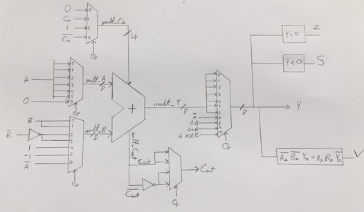
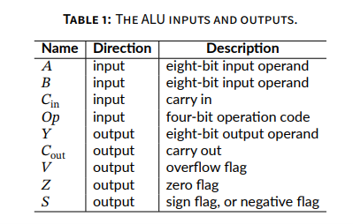

# Building an ALU using VHDL

The VHDL programming language was used to construct a simple ALU. This was the last of 4 practicals for [CCE1013: Computer Logic 1](https://www.um.edu.mt/courses/studyunit/CCE1013), a course forming part of my B.Sc. in Computer Science.

The Arithmetic Logic Unit created can be seen below.

  
   
  ALU sketch

# Task Breakdown

To achieve the creation of a fully functioning ALU, 4 practical sessions were required for the proper exposure and understanding of VHDL (in relation to circuit programming).

These practicals aimed to fulfill the following:

- Practical 1:

  - Familiarisation with the Xilinx ISE Design Suite.
  - Simulation of simple combinational circuits.
  - Observation of _Static_ and _Dynamic_ hazards in signals.

- Practical 2:

  - Building and testing a _Carry-Ripple_ adder.
  - Building and testing a _Carry-Lookahead_ adder.
  - Comparing both adders using _propagation delay_.

- Practical 3:

  - Investigating the difference between _signed_ and _unsigned_ multipliers.

- Practical 4:

  - Using the knowledge obtained from past practicals to design and implement a simple ALU having the following inputs and outputs.
  
  

    
     
    Inputs and Ouputs of the ALU created
  

# Documentation

Individual reports for every practical session can be found [here](https://github.com/tristan-oa/ALU-in-VHDL/tree/master/code).

Each sub-directory contains a report titled _Assignment_SPECIFICATION.pdf_, which describes the design process requirements for the chosen practical.

Another report titled _DOCUMENTATION.pdf_ was also included for a detailed technical documentation of the source code.
